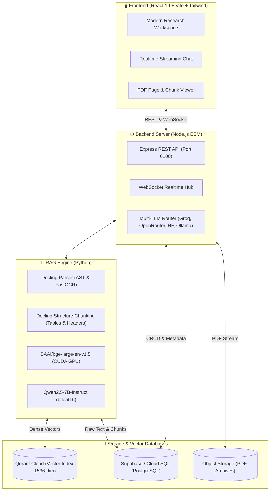

# SchoolSummar — Research RAG Web Application

[](https://react.dev/)
[](https://www.typescriptlang.org/)
[](https://vitejs.dev/)
[](https://tailwindcss.com/)
[](https://nodejs.org/)
[](https://qdrant.tech/)
[](https://supabase.com/)
[](https://huggingface.co/Qwen/Qwen2.5-7B-Instruct)

**SchoolSummar RAG** là nền tảng web thông minh hỗ trợ đọc, phân tích và hỏi đáp chuyên sâu trên các bài báo và tài liệu khoa học phức tạp. Hệ thống kết hợp phân tích bố cục chuyên sâu (**Docling Structure-Aware**), tìm kiếm ngữ nghĩa thời gian thực trên **Qdrant Cloud**, cơ sở dữ liệu quan hệ **Supabase**, và mô hình ngôn ngữ **Qwen2.5-7B** có trích dẫn nguồn xác thực (*grounded citations*).

---

## 🏛️ Kiến Trúc Hệ Thống (System Architecture)



---

## ✨ Điểm Nhấn Công Nghệ Cốt Lõi

1. **Docling Structure-Aware Chunking**:
   - Khác biệt với các phương pháp chia đoạn truyền thống (dễ bị cắt đứt giữa các dòng bảng biểu), thuật toán bám sát cây phân cấp AST của tài liệu, bảo tồn **100% nguyên vẹn cấu trúc bảng biểu Markdown** và duy trì chuỗi breadcrumb ngữ cảnh (`Heading > Subheading`).
2. **Qwen2.5-7B-Instruct Local SLM**:
   - Chuẩn hóa mô hình ngôn ngữ cục bộ trên kiến trúc Qwen2.5 7B tối ưu bfloat16 cho GPU CUDA, triệt tiêu ảo giác (*zero hallucination*) với khả năng từ chối trả lời (*negative rejection*) khi dữ liệu không nằm trong tài liệu.
3. **Hybrid Cloud Data Architecture**:
   - **Vector Database**: Qdrant Cloud (Cosine Similarity, Payload Filtering theo Document ID / Page Index).
   - **Relational Storage**: Supabase PostgreSQL lưu trữ toàn bộ metadata, văn bản thô, sessions và audit log truy vấn.
   - **Multi-LLM Resilience**: Tự động chuyển đổi mượt mà giữa mô hình cục bộ và các nhà cung cấp đám mây (Groq, OpenRouter, HuggingFace).

---

## 📁 Cấu Trúc Thư Mục Chuẩn (Project Layout)

```text
RAG/
├── src/                        # 🎨 Frontend Webapp (React 19 + TypeScript + Vite)
│   ├── App.tsx                 # Giao diện chính RAG Research Workspace
│   ├── LandingPage.tsx         # Trang giới thiệu / Onboarding
│   ├── components/             # Bộ UI Components & AI Elements
│   └── lib/                    # Supabase client & utilities
│
├── server/                     # 🚀 Backend API Server (Node.js ESM)
│   ├── app.mjs                 # Cấu hình Express, REST routes & WebSocket hub
│   ├── llm.mjs                 # Router LLM đa nhà cung cấp & failover
│   ├── docling.mjs             # Adapter tích hợp Docling ingestion
│   ├── rag.mjs                 # Retrieval & Streaming Answer Pipeline
│   └── supabase.mjs            # Client kết nối Supabase Cloud SQL
│
├── rag_engine/                 # 🧠 Core Python RAG Engine
│   ├── chunkers/               # Docling Structure-Aware Chunker
│   ├── models/                 # Qwen2.5-7B-Instruct SLM Engine
│   ├── embeddings/             # BAAI/bge-large-en-v1.5 Retriever
│   ├── parsers/                # Docling AST Parser
│   └── storage/                # SQLite & Metadata Store
│
├── database/                   # 🗄️ Database Schemas & Migrations
│   └── migrations/             # SQL Migrations cho Supabase / PostgreSQL
│
├── tools/                      # 🛠️ Webapp CLI Utilities
│   ├── cloud_sql_tool.mjs      # Quản lý & kiểm tra kết nối Supabase
│   ├── qdrant_cli.mjs          # Quản lý collections Qdrant Cloud
│   └── verify_cuda.py          # Kiểm tra cấu hình GPU CUDA
│
├── dev.mjs                     # Script khởi chạy môi trường phát triển
├── server.mjs                  # Script khởi chạy máy chủ production
├── package.json                # Danh mục phụ thuộc Node.js
└── index.html                  # Single Page Application Entrypoint
```

---

## ⚡ Hướng Dẫn Cài Đặt & Khởi Chạy (Quickstart)

### 1. Yêu cầu hệ thống
- **Node.js**: >= 20.x
- **Python**: >= 3.10 (Khuyến nghị có GPU NVIDIA hỗ trợ CUDA)

### 2. Cài đặt thư viện
```bash
# Cài đặt Node.js dependencies
npm install

# Tạo và kích hoạt môi trường ảo Python
python -m venv .venv-cuda
# Trên Windows:
.\.venv-cuda\Scripts\activate
# Trên Linux/macOS:
source .venv-cuda/bin/activate

# Cài đặt thư viện Python
pip install torch torchvision torchaudio --index-url https://download.pytorch.org/whl/cu121
pip install sentence-transformers qdrant-client transformers accelerate pymupdf
```

### 3. Cấu hình biến môi trường
Sao chép file mẫu và điền các khóa API của bạn:
```bash
cp .env.sample .env
```
Các thông số chính trong `.env`:
- `QDRANT_URL` & `QDRANT_API_KEY`: Kết nối cụm Qdrant Cloud.
- `NEXT_PUBLIC_SUPABASE_URL` & `NEXT_PUBLIC_SUPABASE_PUBLISHABLE_KEY`: Kết nối Supabase.
- `GROQ_API_KEY` (Tùy chọn): Khóa miễn phí cho Llama 3.1 8B.

### 4. Khởi chạy Web Application
Chỉ với một lệnh duy nhất để khởi chạy đồng thời cả Frontend và Backend:
```bash
npm run dev
```
- **Frontend SPA**: `http://localhost:5173` (Hỗ trợ Vite Hot Module Replacement)
- **Backend API**: `http://localhost:6100`

---

## 🧪 Kiểm Thử Hệ Thống (Quality Assurance)

Dự án được bảo đảm chất lượng nghiêm ngặt qua 3 lớp kiểm thử:

1. **E2E Browser Testing (Playwright + Chromium)**:
   - Kiểm thử toàn diện hành trình người dùng trên Google Chrome thật: từ Landing Page, điều hướng Workspace, render giao diện chat đến trình xem trước tài liệu.
2. **Backend & LLM Router Tests**:
   - Kiểm tra khả năng xử lý upload PDF, định dạng Docling và cơ chế tự động chuyển vùng (*failover*) giữa các nhà cung cấp LLM:
   ```bash
   npm test
   ```
3. **Python End-to-End RAG Verification**:
   - Kiểm thử đồng bộ vector lên Qdrant Cloud, tính toán embedding BGE trên GPU CUDA và đối chiếu độ chính xác ngữ nghĩa:
   ```bash
   python tests/test_full_rag_pipeline.py
   ```

---

## 👥 Thành Viên Tham Gia Dự Án (Project Members)

1. **Đặng Quang Nhật**
2. **Phạm Minh Tiến**
3. **Nguyễn Thái Hưng**
4. **Trương Công Phúc**
5. **Phan Tuấn Hưng**

---

## 📄 License
Phát triển và phân phối dưới giấy phép [MIT License](LICENSE).

