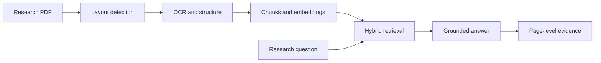

<div align="center">

# RAG Research

### Make every paper work harder.

Turn dense research PDFs into a searchable workspace with grounded answers,
inspectable evidence, and conversations that keep their context.

[](https://react.dev/)
[](https://www.typescriptlang.org/)
[](https://nodejs.org/)
[](#how-it-works)

**Private by default · Page-level citations · Built for researchers**

[Quick start](#quick-start) · [How it works](#how-it-works) · [Architecture](#architecture) · [Team](#team)

</div>

---

## Why RAG Research?

Research should not feel like repeatedly searching the same 40-page PDF.
RAG Research keeps the document, the question, and the evidence connected in
one calm workspace.

- **Understand the whole paper** — preserve titles, sections, figures, tables,
  reading order, and page context during ingestion.
- **Ask with confidence** — trace each answer back to its paper, page, passage,
  retrieval score, and visual region.
- **Keep the research thread** — organize papers into projects and return to
  earlier conversations without losing context.
- **Stay available** — route generation through multiple LLM providers and
  fall back to grounded extractive answers when hosted models are unavailable.
- **Start without infrastructure** — use the built-in memory store, local file
  storage, and mock Docling adapter for a zero-service local demo.

## How It Works



1. **Ingest** a PDF and register its immutable source file.
2. **Map** pages, layout blocks, OCR text, figures, and reading order.
3. **Index** structured chunks for semantic and full-text retrieval.
4. **Ask** a question inside a project-aware chat session.
5. **Verify** the answer through citations that remain attached to the source.

## Product Highlights

| Experience | What it gives you |
| --- | --- |
| Research workspace | Project-scoped chat, source panel, prompts, and conversation history |
| Paper library | Uploads, collections, processing state, search, and document details |
| Evidence inspector | Passage, page, retrieval score, and source-region context |
| Resilient generation | Groq, OpenRouter, Hugging Face, Ollama, custom provider, then extractive fallback |
| Realtime processing | WebSocket events for ingestion and chat progress |
| Local authentication | Email/password sessions with HttpOnly cookies and ownership boundaries |

## Quick Start

### Prerequisites

- Node.js 22 or 24
- npm

### Run the development workspace

```bash
git clone https://github.com/quangnhat1504/SchoolSummar.git
cd SchoolSummar
npm ci
cp .env.sample .env
npm run dev
```

The command starts:

- the API at `http://localhost:6100`;
- Vite on the first available port starting at `http://localhost:5173`;
- `/api` and `/realtime` proxies from the frontend to the API.

The sample environment is intentionally demo-friendly:

```dotenv
STORE_MODE=memory
DOCLING_MODE=mock
AUTH_REQUIRED=false
```

No PostgreSQL, S3, Redis, Python, Docling model, or hosted LLM key is required
to explore the local application.

### Run a production-like local build

```bash
npm run build
npm start
```

Open `http://localhost:6100`.

## Configuration

Copy `.env.sample` to `.env`, then enable only the services you need.

| Capability | Local default | Production option |
| --- | --- | --- |
| Metadata and chat storage | In-memory store | PostgreSQL + pgvector |
| PDF and page assets | Local `storage/` | S3-compatible object storage |
| Document conversion | Deterministic mock | Docling service or CLI |
| Authentication | Demo identity allowed | Required signed sessions |
| Answer generation | Extractive fallback | Hosted or local LLM provider chain |

For a production deployment, set a strong `AUTH_SESSION_SECRET`, enable
`AUTH_REQUIRED=true`, configure persistent storage, and choose
`DOCLING_MODE=service` or `DOCLING_MODE=cli`.

### LLM provider chain

```dotenv
LLM_PROVIDER=auto
LLM_PROVIDER_ORDER=groq,openrouter,huggingface,ollama,custom
GROQ_API_KEY=your_key_here
GROQ_MODEL=llama-3.1-8b-instant
```

Provider state is available at `GET /api/v1/llm/health`. See
[docs/llm-providers.md](docs/llm-providers.md) for setup notes and fallback
behavior.

## Architecture

```text
React + Vite
    │
    ├── REST API ───────────────┐
    └── WebSocket realtime      │
                               ▼
                         Node.js service
                        /       |        \
                 Auth + RAG  Docling   LLM router
                     │          │          │
                     ▼          ▼          ▼
              PostgreSQL    Object      Hosted/local
               + pgvector   storage      providers
```

Large binaries remain in object storage. PostgreSQL stores user ownership,
paper metadata, processing runs, extracted text, chunks, embeddings, chat
messages, and evidence snapshots.

Read [docs/data-architecture.md](docs/data-architecture.md) for the storage,
row-level security, ingestion, and citation contracts.

## Repository Guide

| Path | Responsibility |
| --- | --- |
| `src/` | React landing page, workspace, and reusable UI |
| `server/` | API, auth, stores, uploads, Docling, retrieval, LLM routing, realtime |
| `database/` | PostgreSQL/pgvector migration and data invariants |
| `docs/` | Architecture and provider documentation |
| `design-system/` | Visual language and interaction guidance |
| `tests/` | Backend, pipeline, realtime, auth, and provider-failover tests |

## Quality Checks

```bash
npm run check
npm test
npm run build
```

Health endpoints:

```text
GET /api/health
GET /api/ready
GET /api/v1/llm/health
```

## Team

**RAG Research is a five-person team project built by:**

- Quang Nhật
- Thái Hưng
- Minh Tiến
- Công Phúc
- Tuấn Hưng
