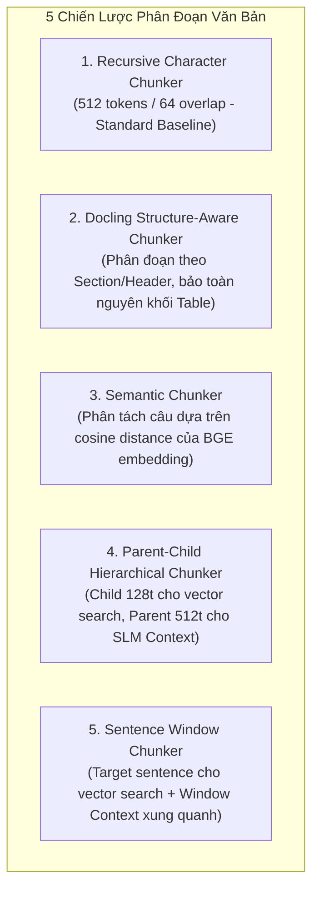

# Báo cáo Triển khai Phase 1: Môi trường & Core Modules RAG Pipeline

**Dự án**: Nghiên cứu & Benchmark RAG với Docling FastOCR, BGE-Large, Small LLMs & So sánh 5 Phương pháp Chunking.  
**Ngày thực hiện**: 2026-08-29  
**Môi trường thực thi**: Local GPU NVIDIA GeForce RTX 5070 Ti (16GB VRAM), PyTorch 2.11.0+cu128, Python 3.13 (Anaconda).

---

## 1. Mục tiêu Hoàn thành trong Phase 1

1. **Khảo sát Phần cứng & Môi trường**:
   - Xác định GPU: `NVIDIA GeForce RTX 5070 Ti` với **17.09 GB VRAM**.
   - Cài đặt đầy đủ các thư viện nòng cốt: `docling`, `sentence-transformers`, `faiss-cpu`, `rapidocr-onnxruntime`, `transformers`, `torch`.

2. **Kiến trúc Module hóa Pipeline (`src/rag_pipeline/`)**:
   - `schema.py`: Định nghĩa chuẩn giao tiếp dữ liệu (`DocumentNode`, `Chunk`, `RetrievalItem`, `RetrievalResult`, `EvaluationSample`).
   - `parsers/docling_parser.py`: Trích xuất tài liệu giữ nguyên bảng biểu, AST nodes và header hierarchy thông qua **Docling** kết hợp backend **FastOCR / RapidOCR**.
   - `embeddings/bge_retriever.py`: Vector index và Cosine Similarity Search với model **`BAAI/bge-large-en-v1.5`** + **FAISS FlatIP** trên CUDA.
   - `chunkers/`: Cài đặt 5 chiến lược phân đoạn văn bản độc lập.
   - `models/slm_engine.py`: Engine nạp và suy luận Small LLM local (`Qwen2.5-3B-Instruct`, `Llama-3.2-3B`, `Phi-3.5-mini`) với chế độ `bfloat16`.
   - `evaluation/metrics.py`: Bộ đo lường 5 chiều: *Negative Rejection*, *Faithfulness/Groundedness*, *Noise Robustness*, *Information Integration*, *Token F1/Exact Match*.
   - `benchmarks/run_benchmark.py`: Bộ công cụ tự động hóa benchmark và sinh báo cáo so sánh.

---

## 2. Thiết kế Chi tiết 5 Phương pháp Chunking (Task 1)

---

## 3. Thiết kế Bộ Metrics Đánh giá Small LLM (Task 2)

Small LLM (1.5B - 7B) khi nhận context dài thường gặp 2 vấn đề lớn:
1. **Hallucination / Bịa đặt**: Tự sinh câu trả lời khi context không có thông tin.
2. **Noise Distraction**: Bị phân tâm bởi các đoạn context không liên quan.

Để đo lường định lượng các năng lực này, pipeline áp dụng:
- **Negative Rejection Accuracy**: Đo tỉ lệ model trả lời đúng `INFORMATION_NOT_AVAILABLE` khi gặp câu hỏi không có trong context.
- **Faithfulness (Token Groundedness)**: Đo tỉ lệ từ khóa trong câu trả lời xuất phát từ context được cung cấp.
- **Information Integration Score**: Đo khả năng tổng hợp dữ liệu từ $\ge 2$ chunks rời rạc.
- **Retrieval Precision & Recall @ Top-K**: Đảm bảo retriever cung cấp đúng context trọng tâm.
