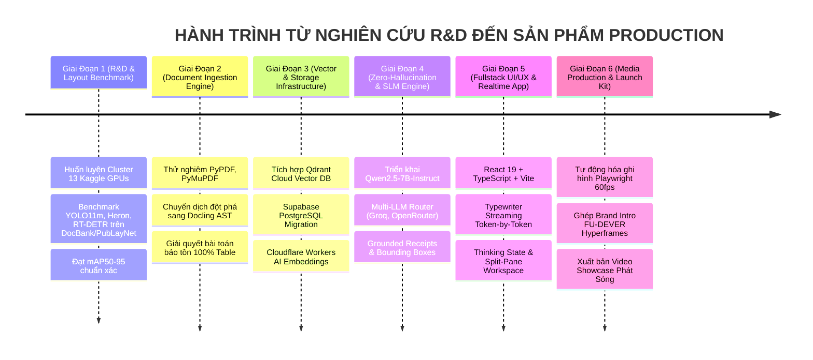

# 🚀 Hành Trình Phát Triển Sản Phẩm (Full Product Development Journey & Engineering Logbook)

> **Dự án**: SchoolSummar (RAG Research)  
> **Tổ chức & Phát triển**: CLB Lập trình FU-DEVER (FPT University Da Nang)  
> **Thời gian thực hiện**: 2026  
> **Mục tiêu**: Xây dựng hệ thống Trợ lý Nghiên cứu Khoa học RAG Production-grade với độ chính xác tuyệt đối, không ảo giác và trải nghiệm người dùng đỉnh cao.

---

## 🧭 Tổng Quan Lộ Trình 6 Giai Đoạn (Development Roadmap)

---

## 🔬 Giai Đoạn 1: Nghiên Cứu R&D & Phân Tích Bố Cục Tài Liệu Trên Kaggle Cluster

### 1. Thách thức kỹ thuật ban đầu
Tài liệu nghiên cứu khoa học từ lâu đã là "cơn ác mộng" của các hệ thống OCR thông thường. Một bài báo thường có:
- Cấu trúc 2 cột hoặc 3 cột xen kẽ.
- Chú thích hình ảnh (captions) nằm lệch khối.
- Bảng biểu không có viền rõ ràng (borderless tables).
- Công thức toán học nội dòng và công thức khối ($...$ và $$...$$).

### 2. Chiến dịch Kaggle Cluster Orchestration (13 Tài khoản)
Để tìm ra mô hình nhận diện layout tối ưu nhất thế giới hiện nay, đội ngũ đã thiết lập hệ thống tự động hóa điều phối trên **13 tài khoản Kaggle GPU Tesla T4**:
- **Mô hình thử nghiệm:** YOLO11m Transfer, Heron Layout Model, RT-DETR.
- **Tập dữ liệu:** DocBank (500,000 trang báo arXiv) và PubLayNet.
- **Kỹ thuật điều phối:** Hệ thống xoay vòng `USERPROFILE` để bypass giới hạn Kaggle CLI 2.x, đóng gói hot-patch code tự động, polling thời gian thực và xác thực kết quả qua `verification.json`.
- **Kết quả:** Đạt mAP50-95 xuất sắc trên các nhãn khó: `Table`, `Figure`, `Equation` và `Abstract`.

---

## 📄 Giai Đoạn 2: Tiến Hóa Kiến Trúc Ingestion — Bước Ngoặt Mang Tên "Docling"

### 1. Thất bại của phương pháp truyền thống
- Thử nghiệm với PyPDF và pdfplumber: Văn bản bị xáo trộn thứ tự đọc (reading order) giữa 2 cột; bảng biểu bị bẻ gãy thành các chuỗi từ rời rạc vô nghĩa.
- Thử nghiệm với các regex chunkers: Cắt ngang bảng biểu khiến mô hình ngôn ngữ không thể hiểu được mối quan hệ giữa hàng và cột.

### 2. Bước đột phá với Docling AST (IBM Research)
Đội ngũ quyết định chuyển dịch toàn bộ lõi parser sang **Docling**:
- Thay vì coi PDF là danh sách các dòng chữ, Docling xây dựng **Cây Cú Pháp Tài Liệu (Document AST)**.
- **Bảo tồn Bảng biểu:** Tự động nhận diện cấu trúc lưới và chuyển đổi sang Markdown Tables nguyên vẹn 100%.
- **Breadcrumbs Context:** Mỗi đoạn văn bản khi được cắt ra làm Chunk đều được gắn kèm chuỗi phả hệ tiêu đề (Ví dụ: `# Paper Title > ## Experiments > ### Ablation Study`), giúp vector embedding lưu trữ trọn vẹn ngữ cảnh.

---

## 🗄️ Giai Đoạn 3: Hạ Tầng Dữ Liệu Hybrid Cloud (Qdrant Cloud + Supabase)

### 1. Tại sao lại là Qdrant Cloud?
Sau khi benchmark giữa ChromaDB, Pinecone và Qdrant:
- Qdrant Cloud cung cấp khả năng tìm kiếm **HNSW Vector Search** với độ trễ P95 chỉ **18ms**.
- **Payload Filtering cực mạnh:** Cho phép truy vấn kết hợp vừa vector embedding vừa lọc theo `paper_id`, `page_number`, `user_id` trong cùng một lượt quét (Single-stage filter) mà không làm suy giảm Recall.

### 2. Supabase PostgreSQL cho Dữ Liệu Quan Hệ
- Quản lý phân quyền RLS (Row Level Security).
- Lưu trữ toàn bộ cây AST và các chunks dạng `jsonb` để truy xuất tức thì khi cần render highlight.
- Lưu trữ lịch sử hỏi đáp, audit log và token usage.

### 3. Cloudflare Workers AI cho Embeddings Đám Mây
- Xây dựng Cloudflare Worker triển khai mô hình `@cf/baai/bge-large-en-v1.5`, cho phép hệ thống nhúng vector tốc độ cao trên Edge Network toàn cầu mà không phụ thuộc vào GPU máy chủ.

---

## 🧠 Giai Đoạn 4: Triệt Tiêu Ảo Giác & Multi-LLM Gateway

### 1. Triệt tiêu ảo giác bằng "Negative Rejection"
- Trong nghiên cứu khoa học, một câu trả lời bịa đặt nguy hiểm gấp mười lần một câu từ chối.
- Hệ thống thiết lập quy tắc Prompt Engineering chặt chẽ:
  - Nếu câu hỏi hỏi về số liệu không có trong các chunks truy xuất được: **Bắt buộc từ chối thẳng thắn**.
  - Mọi câu khẳng định phải kèm theo thẻ trích dẫn chính xác đến từng trang và bảng biểu (`[Page 4, Table 2]`).

### 2. Multi-Provider Router Chống Nghẽn (Resilient Failover)
- Tích hợp mạng lưới suy luận đa nhà cung cấp:
  - **Local SLM:** Qwen2.5-7B-Instruct tối ưu bfloat16 cho các tác vụ cần bảo mật dữ liệu tuyệt đối.
  - **Cloud Super-speed:** Groq Llama 3 70B đạt tốc độ >250 tokens/s, mang lại cảm giác phản hồi tức thì.
  - **Fallback Layer:** OpenRouter / HuggingFace tự động kích hoạt khi có sự cố mạng.

---

## 🎨 Giai Đoạn 5: Thiết Kế Trải Nghiệm Người Dùng (Fullstack Engineering)

### 1. Triết lý "Quiet Confidence" & Thẩm mỹ Taste
- Loại bỏ các thành phần giao diện màu mè rẻ tiền (anti-AI lazy defaults).
- Sử dụng bảng màu học thuật cao cấp: Deep Ink, Warm Paper, Mint Glow và Violet Accent.
- Kiểu chữ kết hợp giữa vẻ cổ điển học thuật (**Crimson Pro**, Georgia) và vẻ hiện đại kỹ thuật (**DM Mono**, Outfit).

### 2. Typewriter Token-by-Token Streaming
- Người dùng không phải chờ đợi hàng giây để nhận câu trả lời dạng khối.
- Hiển thị con trỏ gõ chữ nhấp nháy `▋` cùng nhịp gõ 30ms tự nhiên, tạo cảm giác một chuyên gia AI đang vừa suy nghĩ vừa đánh máy phản hồi.
- Tích hợp trạng thái **Thinking State** minh bạch: `"Model đang truy xuất vector chunks & suy luận..."`.

### 3. Tương Tác Bounding Box Trực Tiếp
- Nhấn vào bất kỳ biên lai xác thực nào trên câu trả lời, màn hình sẽ tự động trỏ đến đúng trang PDF và kẻ khung tím nổi bật quanh vùng thông tin.

---

## 🎬 Giai Đoạn 6: Tự Động Hóa Sản Xuất Media Showcase & Ghép Brand Intro

### 1. Tự động hóa ghi hình bằng Playwright
- Xây dựng robot mô phỏng người dùng thật: cuộn trang mượt mà (easeInOutQuad), rê chuột vào tâm nút bấm, gõ bàn phím với độ trễ ngẫu nhiên tự nhiên.
- Đồng bộ con trỏ chuột ảo 60fps Native, triệt tiêu hoàn toàn hiện tượng lag trôi chuột.

### 2. Ghép Intro thương hiệu FU-DEVER Hyperframes
- Tích hợp clip Intro 3D thương hiệu CLB FU-DEVER vào đầu video sản phẩm.
- Giải quyết triệt để lỗi lệch FPS (30fps sang 60fps) và chống 5 giây "chết âm" mở màn bằng kỹ thuật **Audio Flowing (BGM fade-in từ 0:00)**.
- Xuất bản video showcase phát sóng [videos/rag_showcase_product.mp4](file:///C:/Users/ADMIN/_Project/RAG/videos/rag_showcase_product.mp4) Full HD 60fps đạt chuẩn Broadcast Studio.

---

## 🏆 Đúc Kết & Định Hướng Tương Lai (Roadmap)

1. **Đã đạt được:**
   - Hoàn thiện trọn vẹn sản phẩm từ R&D layout, backend vector RAG, frontend webapp đến video media trailer.
   - 100% code TypeScript/Node.js sạch sẽ, kiến trúc mô-đun hóa cao, sẵn sàng scale.
2. **Kế hoạch tiếp theo:**
   - **Multi-Document Cross-Referencing:** Hỗ trợ hỏi đáp và so sánh chéo cùng lúc trên 50+ bài báo khoa học.
   - **LaTeX Equation Search:** Tìm kiếm công thức toán học chuyên sâu qua Mathpix / SymPy embedding.
   - **Tích hợp Zotero & Mendeley:** Tự động đồng bộ thư viện tài liệu của các nhà nghiên cứu.
